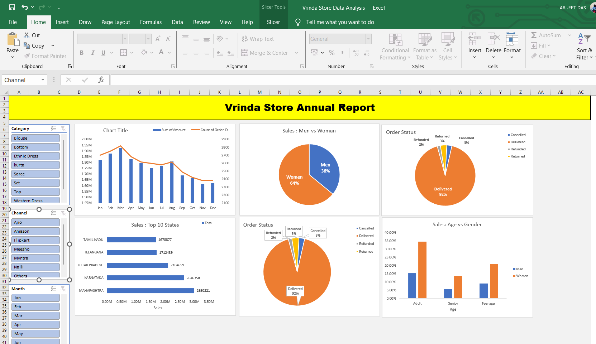

# Vrinda Store Annual Sales Analysis (Excel Dashboard)

## 📊 Project Overview
This project presents an **annual sales analysis of Vrinda Store**, created using **Microsoft Excel** from a large raw dataset.  
The goal of the analysis is to uncover **sales trends, customer behavior, regional performance, and operational efficiency** through pivot tables, charts, and an interactive dashboard.

The insights extracted help understand **what drives revenue, who the key customers are, and where business improvements can be made**.

---

## 🛠 Tools & Techniques Used
- Microsoft Excel  
- Pivot Tables & Pivot Charts  
- Slicers (Category, Channel, Month)  
- Data Cleaning & Aggregation  
- Dashboard Design & Visualization  

---

## 📈 Key Insights

### 1. Monthly Sales & Order Trends
- **Highest sales and orders recorded in March**
- Strong performance in **Q1 (Jan–Mar)** followed by a gradual decline
- **Lowest sales observed in Oct–Nov**, with slight recovery in December  
- Indicates **seasonal demand patterns**

---

### 2. Gender-wise Sales Distribution
- **Women contribute 64% of total sales**
- **Men contribute 36% of total sales**

📌 Women customers are the **primary revenue drivers**

---

### 3. Top Performing States
Top revenue-generating states:
1. Maharashtra  
2. Karnataka  
3. Uttar Pradesh  
4. Telangana  
5. Tamil Nadu  

📌 Sales are concentrated mainly in **West and South India**

---

### 4. Order Status Analysis
- **Delivered:** ~92%  
- **Cancelled:** ~3%  
- **Returned:** ~3%  
- **Refunded:** ~2%  

📌 High delivery success rate indicates **strong operational efficiency**

---

### 5. Age vs Gender Analysis
- **Adult women** form the largest customer segment
- Teen women show strong future growth potential
- Senior men represent the smallest segment

📌 Target customer persona: **Adult women shoppers**

---

## 📊 Dashboard Preview
Below is the interactive Excel dashboard used for analysis:



---

## 📂 Project Structure

```text
vrinda-store-sales-analysis/
│
├── Vrinda_Store_Annual_Report.xlsx
├── Dashboard_Screenshot.png
└── README.md

```
---

## 📌 Conclusion
This Excel-based analysis highlights:
- Clear **seasonality in sales**
- Strong dominance of **women customers**
- High contribution from specific states
- Efficient order fulfillment

The dashboard can be used for **business decision-making, performance tracking, and strategy planning**.

---

## 🚀 Future Improvements
- Add KPIs like **Average Order Value (AOV)** and **Repeat Purchase Rate**
- Analyze **returns by product category**
- Automate dashboard using **Power BI or Tableau**

---

## 👤 Author
**Arijeet**  
Data Analyst | Excel | Data Visualization  

